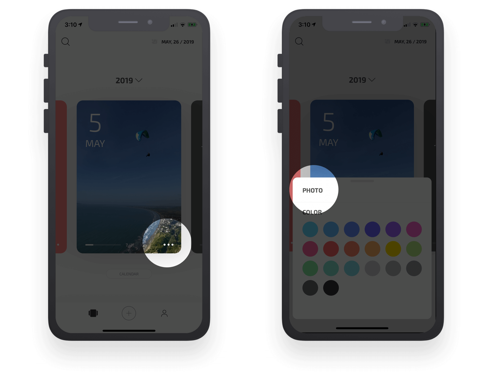
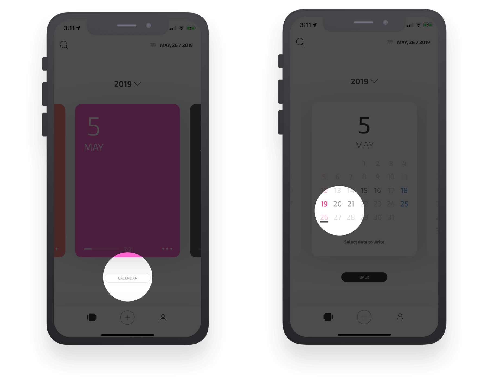
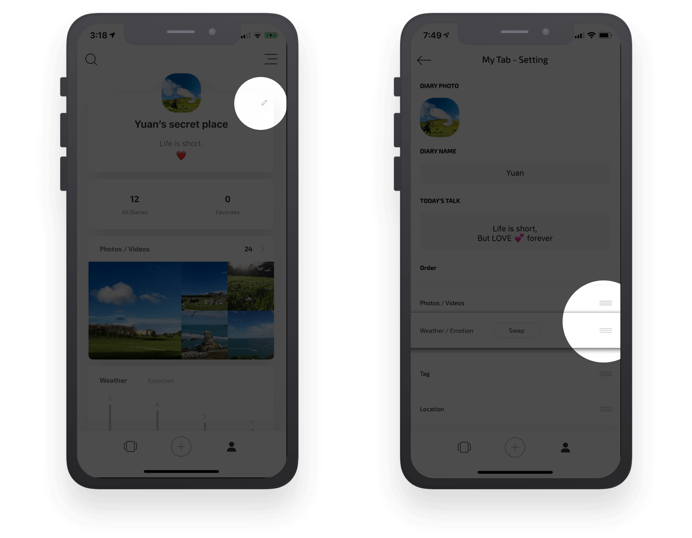

## How to …? 

This topic contains some useful user guides that may help you more enjoyable while using Card Diary.

### How to change month card photo? 

In Card Diary, you can change month card colour or set a photo by only two clicks.

Click the white “**∙∙∙**” button on the right-bottom of month card and then select a colour you like. Or by clikcing PHOTO button, you can set a photo as month card's background.

### How to check how many days you have written diaries?

Want to take a look how many days you didn’t write your journal? Easy to do that. Click “CALENDAR” button under the month card and then all month cards will flip to the calendar side. Days with darker colour means you already written your journals, others means haven’t.

### How to change your profile in Mine page?

You can setup your own profile, your own Card Diary’s name or even mood in “Mine” page. It helps you to reflect yourself or remind yourself how your feeling.

Click the “**Pencil**” button on the right-top of Mine page, then your update DIARY’S “**PHOTO**”, “**NAME**” and today’s talk.

Click and hold on it to drag the item that you selected in “**Order**” section to change all the orders in **Mine** page. E.g. you can move up the most important sections to the top. Or swap Weather/Emotion to show Emotion chart first。

