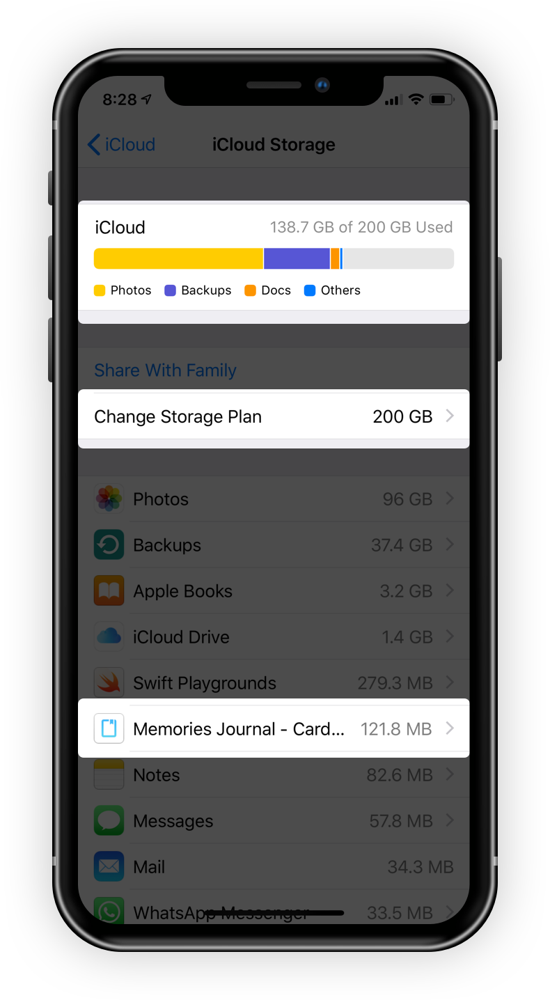

### iCloud Auto Sync

This topic introduced about what is iCloud auto sync for Card Diary and how does it works.

#### What is iCloud Auto Sync?

iCloud Auto Sync is a Card Diary’s syncing service for syncing and backup your diaries to your own iCloud storage on all of your iOS devices. It’s free and available for all users. You don't even need to upgrade to Pro version to use this function. 

#### How does iCloud Auto Sync works?

Card Diary will do all the auto syncing work for you. You don’t need to worry any of details. As long as you Signed In to your iCloud account in your Setting app and have enough iCloud storage, everything has been settled.

#### Is my data safe and private?

Yes and yes. All your diaries are saved on your own devices and your own iCloud storage. We are not able to access your data in any case.

#### How much I should pay for iCloud storage?

It really depends on your usage. Please check your Setting app — Your Name — iCloud — Manage Storage. You can check how much storage Card Diary has been using and you can also change your Storage Plan here as well.

